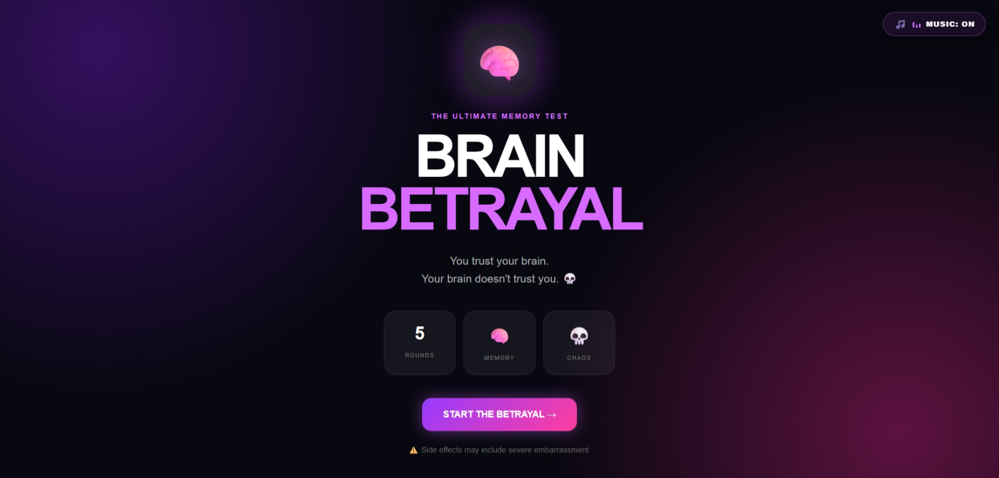
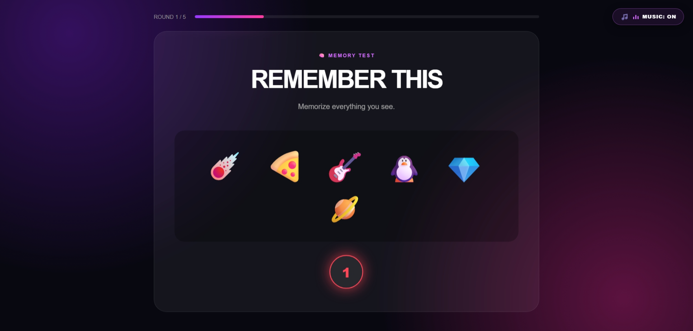
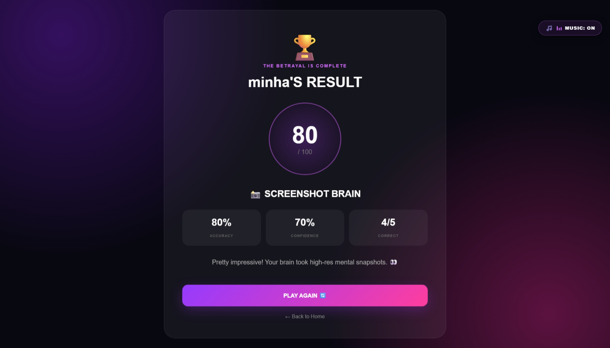

# Brain Betrayal 🧠💀

## Basic Details

### Team Name

[Codex]

### Team Members

* Team Lead: [Rasha fathima] - [EMEA COLLEGE OF ARTS & SCIENCE KONDOTTY]
* Member 2: [Minha EK] - [EMEA COLLEGE OF ARTS & SCIENCE KONDOTTY]

### Project Description

**Brain Betrayal** is a fun interactive memory and attention game with 5 timed rounds. Players test their memory, observation and confidence while earning dynamic scores. Each answer triggers hilarious Malayalam movie reaction GIFs—hype for correct, troll for wrong, and savage reactions for confidently wrong answers.

### The Problem (that doesn't exist)

People have a serious problem of **trusting their brain too much**. Sometimes we remember something completely wrong and still feel 100% confident about it.

### The Solution (that nobody asked for)

Brain Betrayal solves this completely unnecessary problem by putting your brain through 5 quick challenges and exposing exactly how confidently wrong you can be. 😂

## Technical Details

### Technologies/Components Used

**For Software:**

* HTML
* CSS
* JavaScript
* LocalStorage
* VS Code
* Live Server

**For Hardware:**

* Laptop/Computer
* No additional hardware required

## Implementation

### How to Run

1. Download or clone the project.
2. Open the project folder in VS Code.
3. Open `index.html`.
4. Run it using **Live Server**.
5. Start the game and try not to betray your own brain. 💀

## Project Documentation

### Screenshots

### Workflow

**Start → Player Setup → 5 Memory Rounds → Confidence Rating → GIF Reaction → Score Calculation → Final Result**

Made with ❤️ at TinkerHub Useless Projects
